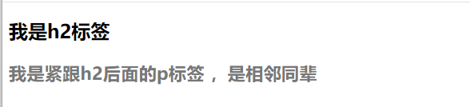
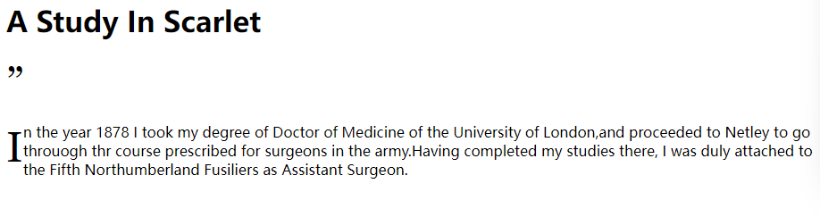
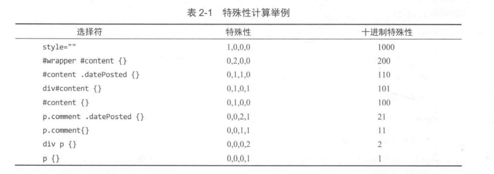
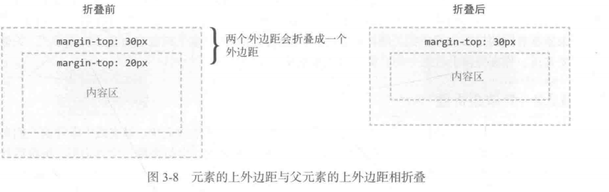

# 精通CSS

> caiye个人学习精通CSS：高级Web标准解决方案（第三版）一书中的读书笔记，网上的教程千奇百怪，还是自己读读书看看文档练习练习来的方便。
>
> 本读书笔记代码仓库：https://github.com/lijianye521/CSS-learning.git

## 第一章 基础知识

HTML5新增的一些元素

section header footer nav article aside main

## 第二章 添加样式

### 2.1CSS选择器

类型选择符用于选择特定类型的元素，比如段落或标题

```css
p{
color:black;
}
```

后代选择符用于选择某个或某组元素的后代‘

```css
blockquote p{
    padding-left:2em;
}
```

为了更精确的选择目标元素，可以使用ID选择符和类选择符

```css
#intro{
font-weight:bold;
}
.date-posted{
color:#ccc;
}
```

此外id和类选择符可以混合使用 不必为所有元素都添加ID和类选择符

```html

<!DOCTYPE html>
<html lang="en">
<head>
    <meta charset="UTF-8">
    <meta name="viewport" content="width=device-width, initial-scale=1.0">
    <title>Document</title>
    <style>
#latest h1 {
font-size:1.8em;
}
#latest .date-posted{
font-weight:bold;
color: blueviolet;
}

    </style>
</head>
<body>
    <!-- <i>caiye</i><p>caiye</p> -->
<article id="latest">
    <h1>Happy Birthday,Andy</h1>
    <p class="date-posted">
        <time datetime="2013-01-20">
            20/1/2013
        </time>
    </p>
</article>
</body>
</html>
```

#### 2.1.1子选择器与同辈选择器

子选择符只选择一个元素的直接后代，也就是子元素。

此例子为外部列表项nav的子元素li都会有自定义标签，其他的子元素没有 并且li标签下嵌套的li标签也没有这个样式。（也就是只给列表的子元素添加样式 ，孙子元素不受影响）

```css
#nav > li{
background:url(folder.png) no-repeat left top;
    padding-left:20px;
}
```


相邻同辈选择器可以用于选择位于某个元素后面，并与该元素拥有共同父元素的元素。

```css
h2 + p {
    font-size:1.4em;
    font-weight:bold;
    colorl:#777;
}
```

```html
<!DOCTYPE html>
<html lang="en">
<head>
    <meta charset="UTF-8">
    <meta name="viewport" content="width=device-width, initial-scale=1.0">
    <title>Document</title>
    <style>
        h2 + p {
    font-size:1.4em;
    font-weight:bold;
    color:#777;
}
    </style>
</head>
<body>
    <h2>
        我是h2标签
    </h2>
    <p>
        我是紧跟h2后面的p标签 ，是相邻同辈
    </p>

</body>
</html>
```



\>和+在这里为组合子，/>子组合子和+相邻同辈组合子 实际上还存在一般同辈组合子：~。使用一般同辈选择符可以选择h2元素后面的所有段落

```css
h2 ~ p {
	font-size:1.4em;
    font-weight:bold;
    color:#777;
}
```

#### 2.1.2 通用选择器

通用选择符可以匹配任何元素。通用选择符使用星号*来表示，我们可以使用通用选择符来删除所有元素默认的内外边距。

```css
* {
	padding: 0;
    margin: 0;
}
```

#### 2.1.3属性选择器

属性选择器基于元素是否有某个属性或者是否有某个值来选择元素。

#### 2.1.4伪元素

我们想选择的页面区域不是通过元素来表示的，而我们也不想为此给页面添加额外标记。css为这种情况提供了一种特殊选择器，伪元素。

::first-letter 选择一段文本的第一个字符

::first-line 选择一段文本的第一行

```html
<!DOCTYPE html>
<html lang="en">
<head>
    <meta charset="UTF-8">
    <meta name="viewport" content="width=device-width, initial-scale=1.0">
    <title>Document</title>
    <style>
        .chapter::before{
            content:'”';
            font-size:3em;
        }
        .chapter p::first-letter{
            float: left;
            font-size: 3em;
            font-family: Georgia, 'Times New Roman', Times, serif;
        }
        .chapter::first-line{
            font-family: Georgia, 'Times New Roman', Times, serif;
            text-transform: uppercase;
        }

    </style>
</head>
<body>
    <h1>A Study In Scarlet</h1>
    <section class="chapter">
        <p>
            In the year 1878 I took my degree of Doctor of Medicine of the University of London,and proceeded 
            to Netley to go throuogh thr course prescribed for surgeons in the army.Having completed
            my studies there, I was duly attached to the Fifth Northumberland Fusiliers as Assistant Surgeon.
        </p>
    </section>
</body>
</html>
```



#### 2.1.5伪类

伪类选择器的语法是以一个冒号开头，用于选择元素的特定状态或关系。

```css
   /* 未访问的链接为蓝色 */
        a:link{
            color:blue;
        }
        /* 访问过的为绿色 */
        a:visited{
            color: green;
        }
        /* 悬停及获取键盘焦点时为红色 */
        a:hover,a:focus{
            color:red;
        }
        /* 活动状态时为紫色 */
        a:active{
            color: purple;
        }
```

#### 2.1.6结构化伪类

:nth-child选择器可以用来交替为表格行应用样式。

:nth-child可以像函数一样接受参数如odd和even

```css
tr:nth-child(odd){
background:yellow;
}
/*表格从第一行开始，在后面每隔一行变成黄色背景。就是奇数行变为黄色*/
```

:nth-last-child 与:nth-child相似，只不过倒着计算

:last-child对应于:nth-last-child(1) 选择最后一个子元素

:nth-of-type(N)会选择特定类型的唯一子元素

#### 2.1.7表单伪类

:required必填 :optional可选

```css
input[type="email"]:valid{
    border-color:green;
}
input[type="email"]:invalid{
    border-color:red;
}
```

此外针对type值为number的含有:in-range、:out-of-range伪类，针对readonly有read-only伪类。

### 2.2层叠

稍微复杂的样式表可能存在两条甚至多条规则选择一个元素的情况。CSS通过一种叫做层叠的机制来处理这种冲突。

为给用户更高的优先权，CSS允许用户使用!important覆盖任何规则，包括网站作者使用!important标注的规则。!important要放在属性声明的后面。

```css
p{
font-size: 1.5em !important;
color:#666 !important;  
}
```

层叠机制的重要性级别从高到低分别为

> 标注为!important的用户样式；
>
> 标注为!important的作者样式；
>
> 作者样式；
>
> 用户样式；LO
>
> 
>
> 浏览器（或用户代码）的默认样式。

在此基础上，规则再按照选择器的特殊性排序。特殊性高的选择器覆盖特殊性低的选择器。如果两条规则的特殊性相等，则后定义的规则优先。

### 2.3特殊性（也就是选择器的权重）

### 特殊性的权重

1. **内联样式**：具有最高的特殊性，记作（1,0,0,0）。
2. **ID选择器**：特殊性次之，记作（0,1,0,0）。
3. **类选择器、属性选择器和伪类**：特殊性更低，记作（0,0,1,0）。
4. **类型选择器和伪元素**：具有最低的特殊性，记作（0,0,0,1）。



向量中的四个数字从高位开始比较 如果相同则比较下一位。

本质上而言，如果样式被写在了元素的style属性里的特殊性>写在id属性应用的规则>类选择器，属性选择器和伪类>类型选择器和伪元素

如果真要比较某个相同等级选择器的优先级，需要计算特殊性，此外，如果权重相同，那么以定义顺序靠后的选择器优先，或者有**!important**标记优先。理论上行内样式就是最高的优先级，但是可能会被!important覆盖。

#### 控制特殊性

尽量的采用低特殊性的选择器，对于伪类的顺序应该是:link,:visited,:hover,:focus和:active

> 记住这个就行了
>
> Lord Vader Hates Furry Animals

### 2.4继承

有些属性，像颜色或字体大小，会被应用于它们的元素的后代所继承。

继承的属性没有任何特殊性 连0都算不上。

通用选择符的特殊性为0，但是仍优先于继承的属性

```html
<!DOCTYPE html>
<html lang="en">
<head>
    <meta charset="UTF-8">
    <meta name="viewport" content="width=!, initial-scale=1.0">
    <title>Document</title>
    <style>
    .father{
        color:green;
    }
    *{
        color:black;
    }
    h2{
        color:red;
    }</style>
</head>
<body>

    <p>我是黑色</p>
    <h2>我h2的特殊性高
    </h2>
    <div class="father">
        <p>我本来能继承father的green 但是通用选择符让我是黑色</p>
    </div>
</body>
</html>
```

### 2.5为文档应用样式

#### 2.5.1 link与style元素

```html
<!--可以直接写在style标签中-->

<style>
        h2 + p {
    font-size:1.4em;
    font-weight:bold;
    color:#777;
}
    </style>
<!--从外部文件引用  增加了css样式的复用-->
<link href="/c/base.css" ref="stylesheet" />
<!--除了link元素以外，还可以使用@import指令加载外部css文件 但是link更推荐  后序会讲-->
<style>
@import url("/c/modules.css");
</style>
```

 使用lnik或style在html中添加多个样式表或者样式块时，他们声明的次序就是他们在html源代码中出现的次序。

```html
<link ref="stylesheet" href="css/sheet1.css">
<style>
@import url("/c/sheet2.css");
    h1{
		color:red;
    }
</style>
<link ref="stylesheet" href="css/sheet3.css">

```

最后sheet3.css中的h2样式胜出，因为他是最后一个。

#### 2.5.2性能

度量web性能的一个重要指标就是网页内容实际显示在屏幕上需要多久。这个指标有时也叫“渲染时间”或“上屏时间”

不要把CSS放到body里或者放到页面底部。

**1.减少HTTP请求**

在链接外部样式表时，保证链接的文件数量最少至关重要。线上网页最好把需要加载的CSS文件控制在一个或者两个。此外线上网页尽量也不要使用@import 因为一个请求下载链接受的文件还要额外发送请求取得所有导入的文件。

**2.压缩和缓存内容**

使用gzip压缩线上资源，CSS压缩的比率很高。一般来说CSS文件压缩后会减少70%-80%。

类似的，让Web服务器帮你设置一定的CSS文件缓存时间也很重要。理想情况 下，浏览器只下载一次CSS文件。除非线上文件有变化。方法就是通过HTTP首部来告诉浏览器，把文件缓存较长的一段时间，如果文件有修改，则通过文件名来“清楚缓存”。

> 通过HTTP首部控制浏览器缓存是优化网页加载速度和减少服务器负担的有效方法。以下是实现此目的的常见方法：
>
> ### 1. 缓存控制 HTTP 首部
>
> - **Cache-Control**：这个HTTP首部字段可以用来定义资源的缓存策略。常用的值包括`max-age`（资源可以被缓存并且被重用的最大时间，单位是秒），`no-cache`（强制每次请求都去服务器验证），`no-store`（完全不缓存此资源），等等。例如，`Cache-Control: max-age=31536000`告诉浏览器，资源可以在本地缓存并且在接下来的一年内使用，不需要再去服务器请求。
>
> ### 2. ETag 和 If-None-Match
>
> - **ETag**：是资源的唯一标识符，服务器使用它来识别资源状态是否有变化。
> - 当浏览器第一次请求资源时，服务器在响应中包含一个`ETag`值。当浏览器再次请求该资源时，会发送一个`If-None-Match`请求头，其值为之前收到的`ETag`值。如果`ETag`未改变，服务器返回304状态码，表示内容未修改，浏览器可以从缓存加载资源。如果`ETag`值有变化，则服务器会发送新的资源和`ETag`。
>
> ### 3. 使用文件名版本控制清除缓存
>
> - **文件名版本控制**：当你想强制浏览器清除缓存并获取最新版本的文件时，可以通过更改文件名来实现。这种方法常见于对静态资源如CSS和JavaScript文件的管理。例如，如果你有一个`style.css`文件，可以将其重命名为`style.v2.css`来指示这是一个新版本的文件。通过更改文件名，你实际上改变了资源的URL，因此浏览器会认为这是一个全新的资源并发起新的请求。
>
> ### 实现示例
>
> 假设你有一个CSS文件，名称为`style.css`。在对其进行更新后，你想确保所有用户都能获取到最新版本。你可以这样操作：
>
> 1. 在服务器配置中设置`Cache-Control`首部，为CSS文件指定一个长时间的缓存周期，比如一年（`Cache-Control: max-age=31536000`）。
> 2. 更新CSS文件后，更改其名称，比如从`style.css`更改为`style.v2.css`。
> 3. 更新所有引用该CSS文件的HTML或其他文件，确保它们指向新的文件名。
>
> 这样，即使旧的CSS文件被缓存了很长时间，更改文件名也能保证用户访问时获取的是最新版本的文件。

**3.不让浏览器渲染阻塞javascript**

渲染阻塞会拖慢网站下载速度。为此，主流的做法是在HTML页面底部的结束标签</body>之前加载javascript。

比较现代的方式是在head中使用<script>标签，但是添加async和defer属性。

asycn属性会异步加载脚本，不阻塞HTML解析，但会在脚本加载完毕执行时阻断HTML解析。

defer属性同样是异步加载脚本，不同的是会在HTML解析完毕后在执行加载的脚本。

## 第三章 可见格式化模型

### 3.1盒模型

盒模型是CSS的核心概念，描述了元素如何显示，以及（在一定程度上）如何相互作用，相互影响。outline这个属性（轮廓线）可以在盒子外围画出一条线


#### 3.1.1盒子大小

默认情况下，元素盒子的width和height属性是指内容盒子，也就是元素可渲染内容区域的宽度和高度。这个时候添加边框和内边距不会影响盒子的大小，但是会让盒子变大。

```css
    .mybox{
            width: 80px;
            padding:5px;
            border:5px solid;
            margin:10px;
            background-color: bisque;
        }
```


box-sizing属性可以改变计算盒子大小的方式。box-sizing的默认值为content-box。（对应着标准盒模型）

可以修改box-sizing的值来将width和height属性的值付给内边距和边框。

```css
    .mybox{
          box-sizing:border-box;
            width: 80px;
            padding:5px;
            border:5px solid;
            margin:10px;
            background-color: bisque;
        }
```


内边距和外边距的值可以是CSS规范中规定的任意长度单位px，em，百分比之类。

```css
.block{
    margin-left:5%;
}
```

这里的百分之5是指父元素.group的百分之5。如果.group的宽度是100像素，那么这里左边距就是5像素。

因元素的高度常常不被声明，因内容多少而差异很大，所以CSS规定，上下方位的内外边距，仍然基于包含块来计算。这里，包含块就是父元素，但是有时候规则不一定。具体后序再讲。

#### 3.1.2最大值和最小值

max-width和min-width

max-height和min-height(max-height慎用 容易让内容跑到固定高度之外去)

### 3.2课件格式化模型

p，h1和article都是block box 块级盒子

strong，span 和time 都是inline box 行内盒子

可以使用display属性改变生成的盒子模型。比如把span的display改为block，让span变成块级元素。如果把display改为none，还可以让浏览器不为相应元素生成盒子。

CSS中有几种不同的定位模型，包括浮动、绝对定位和相对定位。

由一行文本形成的水平盒子叫做行盒子，而行盒子的高度由所包含的行内盒子决定，修改行盒子大小的唯一途径就是修改行高 line-height。


#### 3.2.1匿名盒子

不明确定义的元素也会生成块级盒子，也就是**匿名块盒子**。

```css
<section>
some text
<p>
Some more text</p>
</section>
```

"some text"就算没有定义为块级元素 也会生成块级盒子。因为这个盒子不与任何特定元素相关。此外还会存在**匿名行盒子**，比如一个段落包含三段文本，那么每一个文本都是一个**匿名行盒子**。

#### 3.2.2外边距折叠

垂直方向上的两个外边距相遇时，会折叠成一个外边距，折叠后外边距的高度等于两者中较大的那一个高度。





外边距折叠只发生在文档常规文本流中会计盒子的垂直方向上。行内盒子、浮动盒子或绝对定位盒子的外边距不会折叠。

#### 3.2.3包含块

确定元素的包含块，要看元素是如何定位的，如果元素的定位方式为静态定位（即不指定position属性的值）或相对定位，则其包含块的边界就计算到最近的父元素，该元素的display属性必须能够提供类似的块级上下文（如block、inline-block、table-cell、list-item）。如果当前元素的定位模型改成了absolute或者fixed，那么计算依据就会发生变化。

#### 3.2.4相对定位

通过display属性设置为relative，该元素仍然会呆在原来的地方。但此后，可以通过设置top、right、bottom和left属性使元素相对初始位置平移一段距离。


#### 3.2.5绝对定位

相对定位事实上是常规文档流定位模型的一部分，因为元素还是相对于它在常规流中的初始位置来定位。绝对定位会把元素拿出文档流，因此也不会额外占用原来的空间。与此同时，文档流中其他元素会各自重新定位。仿佛以前这个元素没存在过一样。


绝对定位元素的包含块是距离它最近的定位祖先，也就是display属性设置为static之外任意值的祖先元素。如果没有这么一个定位祖先，那么他就相对于文档的根元素即html元素定位。文档的根元素也叫做起始包含块。z-index属性越大，越靠近用户的眼睛。

很少人用这种定位，因为脱离了常规文档流，很难进行响应式变化。

#### 3.2.6固定定位

固定定位元素的包含块是视口viewport。因此，固定定位可以用来创建始终停留在窗口相同位置的浮动元素。

#### 3.2.7浮动

浮动盒子可以向左或者向右移动，直到其外边沿接触到包含块的外边沿，或接触到另一个浮动盒子的外边沿。

浮动元素会导致后面的行盒子缩短，从而造成 文本环绕的效果。不会对周围元素有别的影响，因为他已经脱离了文档流。

#### 3.2.8格式化上下文

**行内格式化上下文中**：行内元素沿着容器的内容区域的内部边缘从左到右排列，直到行被填满，然后换行到下一行。此外，垂直外边距对行内盒子没有影响。行内盒子的高度不受其垂直方向上的内外边距和边框的影响，行内盒子明确设置高度和宽度也没用。


```html
<!DOCTYPE html>
<html lang="en">
<head>
    <meta charset="UTF-8">
    <meta name="viewport" content="width=device-width, initial-scale=1.0">
    <title>Document</title>
    <style>
        strong{
            width: 800px;
            height: 900px;
            margin: 50px;
            border: 20px;
            padding: 20px;
        }
    </style>
</head>
<body>
    <div>

        <strong> 我是行内盒子</strong>
        <br>
        我是块级元素的下一行
    </div>
</body>
</html>
```

**块级格式上下文：**所有块级盒子的左边界默认与包含块的左边界对齐（如果文字是从右向左，那么与包含块的右边界对齐）。

还有些规则允许元素建立自己内部的块级元素上下文，包括：

1. display属性值设置为inliene-block或table-cell之类的元素，可以为内容创建类似块级的上下文；
2. float属性值不是none的元素；
3. 绝对定位的元素；
4. overflow属性值不是visible的元素。

浮动元素从页面流中移出后，通过触发其后的元素中行盒子的缩短行为，制造了为自身腾出四周空间的视觉效果，而其他的元素仍然会按照需要，在浮动元素下方拉伸。

```html
<!DOCTYPE html>
<html lang="en">
<head>
    <meta charset="UTF-8">
    <meta name="viewport" content="width=device-width, initial-scale=1.0">
    <title>Document</title>
    <style>
        .media-block{
            background-color: gray;
            border: solid 1px black;
        }
        .media-fig{
            float: left;
            margin-right: 5%;
        }
        .media-block,.media-body{
            overflow: auto;
        }
    </style>
</head>
<body>
    <div class="media-block">
        
        <div class="media-body">
            <h3>
                Title of this 

            </h3>
            <p>Brief description  of this </p>
        </div>
    </div>
</body>
</html>
```


- 不用设置清除规则，就可以让.media-block包住浮动的图片，因为块级格式化上下文自动包含浮动。
- 书带着，我们可以不用给.media-body声明宽度和浮动，这是因为它会自动调整以适应浮动元素旁边的剩余空间，并确保挨着图片的一边是直的。如果没有新的格式上下文，而且文本比较多，那么位于浮动.media-fig下方的行盒子都会伸长，最终填满图片下方的空间。

#### 3.2.8内在大小与外在大小

比如把某个属性设置为auto，或者使用浮动或块级格式化上下文，在不设置width的情况下达到收缩适应的目的。

contain-floats这个关键字可以让元素包含浮动。

```css
.myThing
{
	min-height:contain-floats;
}
```

### 3.3其他CSS布局模块

#### 3.3.1弹性盒布局

CSS3中新引入的一种布局模型，Flexbox支持对子元素水平或者垂直布局，以及设置这些子元素的大小，间距和对齐方式。还支持改变渲染到页面的次序。

#### 3.3.2网格布局

网格布局是CSS中最早成熟的高层布局工具，网格布局实现了源代码次序的完全分离，从内容结构和个别模块的表现抽象出了网格系统。

#### 3.3.3多栏布局

可以先指定栏数，也可以先指定每一栏的宽度，然后让浏览器根据可用的宽度自动确定栏数。

#### 3.3.4Region

CSS Regions Module Level1可以实现在不同元素间的灌文接排。可以把一个元素作为内容来源，但它不再常规文档流中，其内容可以灌排到页面中的其他占位元素。这意味着布局不再受到HTML的次序影响，也就是把布局表现从内容结构中解耦了出来。

## 第四章 网页排版

### 4.1CSS的基本排版技术

拿到一个页面时，设计者会从body元素开始，逐步细化，从而让整个页面具有基本的可读性，层次性和配色。

#### 4.1.1文本颜色

浏览器会把绝大部分文本设置为黑色，链接除外，它是活力蓝。

#### 4.1.2字体族

字体族font-family属性值是一个备选字体的列表，按优先级从左往右排列。

```css
body{
font-family: 'Georgia Pro ',Georgia, 'Times New Roman', Times, serif;
}        
h1,h2,h3,h4,h5,h6{
font-family: 'Avenir Next','Segoe UI',arial,sans-serif;
}
```

body元素以及其他所有元素使用的字体依次是'Georgia Pro ',Georgia, 'Times New Roman', Times, serif;（因为font-family是一个可以继承的属性）Georgia是一种几乎无处不在的衬线字体，而较新的Georgia Pro则默认安装在某些版本的Windows10中。

对于标题，Avenir Next是首选字体，这种字体在现代Mac OS X 和iOS系统中有很多变体。

这种按优先级从左往右找字体的后备机制，是font-family属性的重要特性。

**字体与字型**

字型（typeface）、字体族（font family）和字体（font）这三种术语经常有人分不清。字型（也叫字体族），就是一组代表字母，数字以及其他具有同意外观样式的字形（glyph）的集合。字型包含的每种字形，通常有粗体、常规、细体、斜体等变体，能够以不同样式显示数值，连字等。
最初，字体是指一种字型中的某些特定变体所包含的所有数字的集合，由金属制成。这些选出来的字形会被装上印刷机。在数字排版领域，字体通常指一个存有某种字型的表示的文件。假设有一种字型叫做"CSS Mastery"那么它可能只有一个字体文件，也可能有多个。例如："CSS Mastery粗体"，"CSS Mastery斜体"，"CSS Mastery常规"。

#### 4.1.3字型大小和行高

几乎所有的浏览器中font-size的大小默认是16px，除非用户修改过偏好设置。我们不会修改默认的font-size，而是选择em单位调整特定元素的大小。

```css
h3{
font-size: 1.314em;/*21px*/
}
```

em单位用于font-size属性时，实际上是一个相应元素继承font-size的缩放因子。比如我们的h3元素，字型大小就1.314*16px=21px。虽然可以直接设置为21px，但是em更灵活一些。多数浏览器都允许用户缩放整个页面，即使像素单位可以缩放。而使用em后，如果用户修改偏好设置中默认font-size大小，那么相应的元素大小也会相应调整。

可以用百分比替代em。133.3%和1.333em没有任何区别。最灵活的方式是使用rem单位。与em类似，rem也是一个缩放因子，但是它始终基于根元素的em大小缩放（根元素的em，也就是root element em 即rem），也就是基于html元素的font-size缩放。其实我们已经使用了rem，给所有标题应用了一致的margin-top。

```css
h1,h2,h3,h4,h5,h6{
margin-top: 1.5rem;/*24px*/
}
```

当em用于计算盒模型大小时，它不是基于继承的font-size，而是基于元素自身计算的font-size。

> [!NOTE]
>
> 长度单位还有mm、cm、in和pt等绝对物理长度，这些主要是给打印样式准备的。网页设计不应该使用这些单位，本章不介绍打印样式表，但会在第八章介绍如何针对不用媒体类型应用样式。

**基于比例缩放字型大小**

标题大小大致符合一个叫做“纯四度”的数学比例，即上一级标题会比下一级标题的字型大小大自身尺寸的1/4或者说下一级标题字型大小的1.3333倍。

#### 4.1.4行间距、对齐以及行盒子构造


第三章介绍过行内格式化，每行文字都会生成一个**行盒子**，行盒子还可以进一步拆分成表示行内元素的**行内盒子**，或者连接两个行内元素的**匿名行内盒子**。

行内盒子的内容区显示文本，内容区的高度由font-size的测量尺度。

每个行内盒子的底边都默认对齐于靠近底部的水平线，这条线叫做**基线**。内容区也不一定能限制住字形，比如小写字母g，就会向下延伸出内容区。

行高是指行盒子的总高度，也就是**行间距**。排版术语叫做**铅空**。就是排字员用来隔开字符行的铅块。 

计算方法：行盒子的整体行高减去font-size，得到的值再除以2，也就是**半铅空**。比如：line-height：30px，font-size：21px，那么半铅空就是（30-21）/2=4.5px。

**设置行高**

```css
body
{
    font-family:'Georgia Pro ',Georgia, 'Times New Roman', Times, serif;
    line-height:1.5;
}
```

一般来说，行高设置为1.2~1.5之间，短文本一般设置较小的line-height，这里1.5是没有单位的值，意思是font-size的1.5倍。也可以给line-height设置像素值，百分比或者em值。但是要注意body的所有子元素都会继承line-height的计算值。就算body用的是百分比或者是em，其子元素集成的都是**计算后**的值，但是无单位就不会导致这样的结果，因此，如果给line-height设置没有单位的值，那么子元素继承的是一个系数，永远与自己的font-size成比例。

**2.垂直对齐**

除了line-height，行内盒子也受到vertical-align的影响。它的默认值是baseline，即子元素的基线与父元素的基线对齐。

```html
<!DOCTYPE html>
<html lang="en">
<head>
    <meta charset="UTF-8">
    <meta name="viewport" content="width=device-width, initial-scale=1.0">
    <title>Document</title>
    <style>
        .ordinal{
            vertical-align: text-bottom; 
            font-size: smaller;
        }
        /* 通过vertical-align设置为上标文本
        text-top或text-bottom会让当前元素的内容区与付行盒子的内容区顶部或底部对齐，
        但只有在行内盒子的font-size或line-height与父元素不同时才会有影响。 */
    </style>
</head>
<body>
    <time datetime="2016-02-23">
        the 23 <span class="ordinal"> rd</span>of February 2016.
    </time>
    
</body>
</html>
```

行盒子中有一个元素使用vertical-align调整位置可能会扩展行盒子的高度。

#### 4.1.5文本粗细

font-weight关键字，常用的有：narmal、bold、bolder、lighter。normal和bold对应的数值分别为400,700。bolder和lighter的机制略有不同，他们的作用是在继承值的基础上把文本变粗或变细。

#### 4.1.6字体样式

font-style:italic会从字型中选择斜体，前提是存在这个斜体。

#### 4.1.7大小写变换和小型大写变体

```css
h1 {
tect-transform:uppercase;
}
```

**使用font-variant**

CSS中使用font-variant可以通过值small-caps让英文文本转化为小型大写字母。

#### 4.1.8控制字母的间距

控制词的间距

```css
p{
    word-spacing:0.1em;
}
```

控制字符间的间距

```css
p{
letter-spacing:0.1em;
}
```

### 4.2版本宽度、律动和毛边

我们可以将article长度设置为36em，平均每个字符0.5em，并在页面上居中，如果视口缩小到比这个值更窄，该元素会自动调整宽度。

```css
article{
   max-width:36em;
   margin:0 auto;
}
```

#### 4.2.1 文本缩进与对齐

默认情况下，文本都是左对齐的，对于连续的段落，我们可以使用相邻组合符设置text-indent属性。

```css
p+p{
text-indent:1.25em;
}
```

text-align属性是可以接受下列任意一个关键字值：left、right、center和justify。CSS 3还额外规定了几个值、包括start和end。这两个逻辑方向关键字与文本书写模式对应：多数西方语言都是从左向右书写，因此如果文本语言是英语，那么start就代表左对齐，end代表右对齐。而在从右往左书写的语言中，恰好相反，父元素设置了dir=“rtl”属性，即从右向左显示，浏览器通常会自动反转默认的文本方向。

**设置连字符**

```css
p{
    hyphens:auto;
}
```


#### 4.2.3多栏文本

