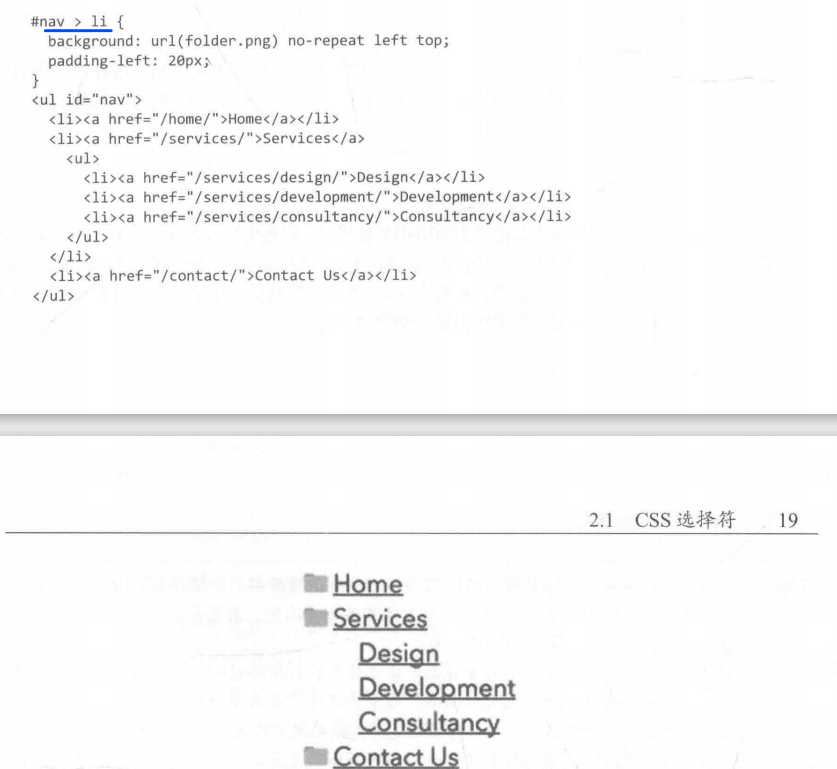
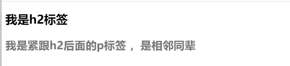

# 精通CSS

## 第一章 基础知识

HTML5新增的一些元素

section header footer nav article aside main

## 第二章 添加样式

### 2.1CSS选择符

类型选择符用于选择特定类型的元素，比如段落或标题

```css
p{
color:black;
}
```

后代选择符用于选择某个或某组元素的后代‘

```css
blockquote p{
    padding-left:2em;
}
```

为了更精确的选择目标元素，可以使用ID选择符和类选择符

```css
#intro{
font-weight:bold;
}
.date-posted{
color:#ccc;
}
```

此外id和类选择符可以混合使用 不必为所有元素都添加ID和类选择符

```html

<!DOCTYPE html>
<html lang="en">
<head>
    <meta charset="UTF-8">
    <meta name="viewport" content="width=device-width, initial-scale=1.0">
    <title>Document</title>
    <style>
#latest h1 {
font-size:1.8em;
}
#latest .date-posted{
font-weight:bold;
color: blueviolet;
}

    </style>
</head>
<body>
    <!-- <i>caiye</i><p>caiye</p> -->
<article id="latest">
    <h1>Happy Birthday,Andy</h1>
    <p class="date-posted">
        <time datetime="2013-01-20">
            20/1/2013
        </time>
    </p>
</article>
</body>
</html>
```

#### 2.1.1子选择符与同辈选择符

子选择符只选择一个元素的直接后代，也就是子元素。

此例子为外部列表项nav的子元素li都会有自定义标签，其他的子元素没有 并且li标签下嵌套的li标签也没有这个样式。（也就是只给列表的子元素添加样式 ，孙子元素不受影响）

```css
#nav > li{
background:url(folder.png) no-repeat left top;
    padding-left:20px;
}
```



相邻同辈选择器可以用于选择位于某个元素后面，并与该元素拥有共同父元素的元素。

```css
h2 + p {
    font-size:1.4em;
    font-weight:bold;
    colorl:#777;
}
```

```html
<!DOCTYPE html>
<html lang="en">
<head>
    <meta charset="UTF-8">
    <meta name="viewport" content="width=device-width, initial-scale=1.0">
    <title>Document</title>
    <style>
        h2 + p {
    font-size:1.4em;
    font-weight:bold;
    color:#777;
}
    </style>
</head>
<body>
    <h2>
        我是h2标签
    </h2>
    <p>
        我是紧跟h2后面的p标签 ，是相邻同辈
    </p>

</body>
</html>
```



\>和+在这里为组合子，/>子组合子和+相邻同辈组合子 实际上还存在一般同辈组合子：~。使用一般同辈选择符可以选择h2元素后面的所有段落

```css
h2 ~ p {
	font-size:1.4em;
    font-weight:bold;
    color:#777;
}
```

#### 2.1.2 通用选择符

通用选择符可以匹配任何元素。通用选择符使用星号*来表示，我们可以使用通用选择符来删除所有元素默认的内外边距。

```css
* {
	padding: 0;
    margin: 0;
}
```

